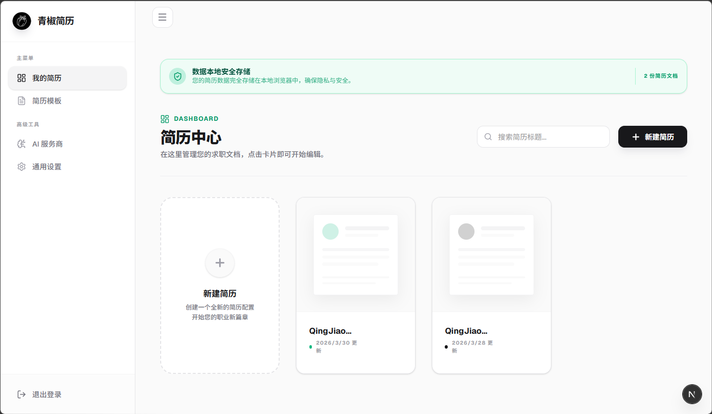
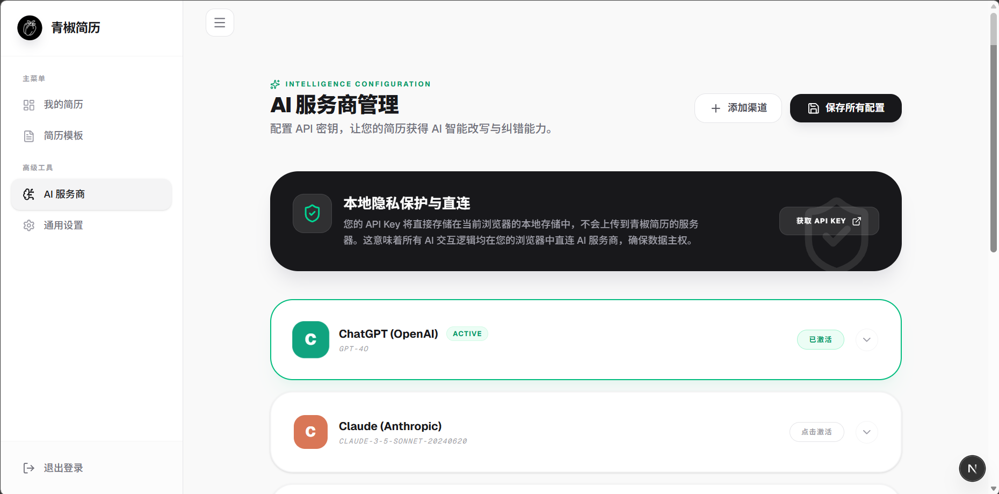
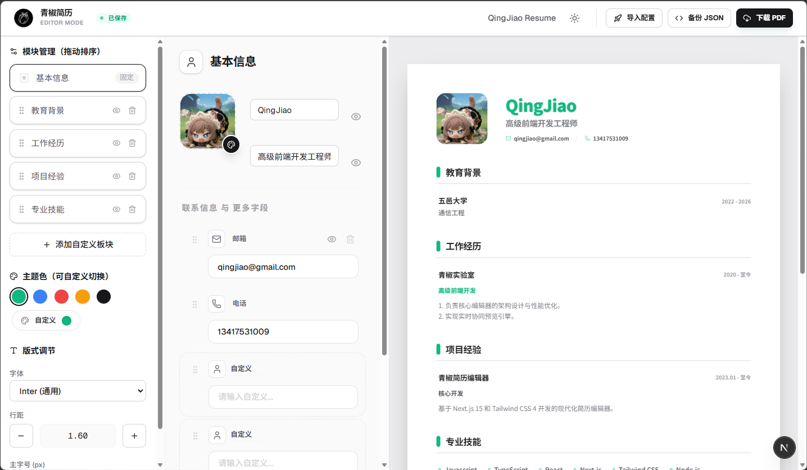

<p align="center">
  
</p>

<h1 align="center">青椒简历 (QingJiao Resume)</h1>

<p align="center">
  
  
  
  
</p>

<p align="center">
  <b>简体中文</b> | <a href="README_EN.md">English</a>
</p>

一个极简、极其流畅且现代化的在线简历编辑器。基于 **Next.js 15**、**Tailwind CSS 4** 和 **Framer Motion** 构建，旨在通过 AI 辅助与极致的 UI 交互，让写简历变成一种享受。







## 核心特性

- **极致响应式布局**：三栏式设计，左侧管理、中间编辑、右侧实时预览，支持自适应屏幕缩放。
- **模块化自由管理**：支持“基本信息”、“教育背景”、“工作经历”、“项目经验”与“专业技能”等模块的自由排序与显隐切换。
- **实时 A4 预览**：高保真的 A4 纸张比例预览，所见即所得，支持 1:1 比例导出。
- **现代化头像处理**：内置 `react-easy-crop`，上传头像后可自由框选范围与缩放。
- **高级排版控制**：
  - **主题色配置**：支持预设方案与自定义 RGB 取值。
  - **字体系统**：内置 Inter、Roboto、Outfit 以及传统宋体。
  - **精细调节**：支持以 0.5px 为单位的字号调节及 0.05px 步长的行高调节。
- **本地存储持久化**：头像与数据自动保存至浏览器本地存储，无须注册即可随用随走。

## 技术栈

- **框架**: [Next.js 15 (App Router)](https://nextjs.org/)
- **UI 逻辑**: [React 19](https://react.dev/)
- **样式**: [Tailwind CSS 4](https://tailwindcss.com/)
- **动画**: [Framer Motion](https://www.framer.com/motion/)
- **图片处理**: [react-easy-crop](https://github.com/ValentinH/react-easy-crop)
- **图标**: [Lucide React](https://lucide.dev/)

## 快速开始

### 1. 安装依赖

```bash
npm install
```

### 2. 启动开发服务器

```bash
npm run dev
```

### 3. 开始创作

访问 `http://localhost:3000/qingjiao_resume/editor` 即可开始编辑您的简历。

## 🤝 贡献与支持 (Contribution)

欢迎任何形式的贡献！无论是修复 Bug、改进 UI，还是增加新的模板和功能特性。

1. **Fork** 本项目
2. **Create** 您的特性分支 (`git checkout -b feature/AmazingFeature`)
3. **Commit** 您的提交 (`git commit -m 'Add some AmazingFeature'`)
4. **Push** 到分支 (`git push origin feature/AmazingFeature`)
5. **Open** 一个 Pull Request

如果您觉得这个项目对你有帮助，欢迎点一个 **Star** ⭐️，这是对作者最大的鼓励！

## ⚖️ 许可证

MIT License.
