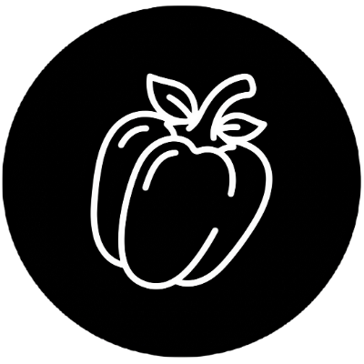

# QingJiao Resume

A minimalist, ultra-smooth, and modern online resume builder. Built with **Next.js 15**, **Tailwind CSS 4**, and **Framer Motion**, designed to make resume writing enjoyable through AI assistance and ultimate UI interaction.

<p align="center">
  
</p>

<p align="center">
  
  
  
  
</p>

<p align="center">
  <a href="README.md">简体中文</a> | <b>English</b>
</p>

<pre class="vditor-reset" placeholder="" contenteditable="true" spellcheck="false"><p data-block="0"></p><p data-block="0"></p></pre>

## Core Features

- **Extreme Responsive Layout**: Three-column design: Management on the left, Editing in the middle, Real-time preview on the right. Supports adaptive screen scaling.
- **Modular Management**: Flexible sorting and visibility toggling for modules like "Basic Info", "Education", "Work Experience", "Projects", and "Skills".
- **Real-time A4 Preview**: High-fidelity A4 paper ratio preview (WYSIWYG), supporting 1:1 ratio export.
- **Modern Avatar Processing**: Built-in `react-easy-crop` for free cropping and scaling of uploaded avatars.
- **Advanced Typography Control**:
  - **Theme Color**: Supports preset schemes and custom RGB values.
  - **Font System**: Built-in Inter, Roboto, Outfit, and traditional SimSun.
  - **Fine-grained Adjustment**: Font size adjustment in 0.5px increments and line height in 0.05px steps.
- **Local Storage Persistence**: Avatars and data are automatically saved to local storage—no registration required.

## Tech Stack

- **Framework**: [Next.js 15 (App Router)](https://nextjs.org/)
- **UI Logic**: [React 19](https://react.dev/)
- **Styling**: [Tailwind CSS 4](https://tailwindcss.com/)
- **Animation**: [Framer Motion](https://www.framer.com/motion/)
- **Image Processing**: [react-easy-crop](https://github.com/ValentinH/react-easy-crop)
- **Icons**: [Lucide React](https://lucide.dev/)

## Getting Started

### 1. Install Dependencies

```bash
npm install
```

### 2. Start Development Server

```bash
npm run dev
```

### 3. Start Creating

Visit `http://localhost:3000/qingjiao_resume/editor` to start editing your resume.

## 🤝 Contributing

Contributions of all kinds are welcome! Whether it's fixing bugs, improving UI, adding new templates, or making new features.

1. **Fork** the Project
2. **Create** your Feature Branch (`git checkout -b feature/AmazingFeature`)
3. **Commit** your Changes (`git commit -m 'Add some AmazingFeature'`)
4. **Push** to the Branch (`git push origin feature/AmazingFeature`)
5. **Open** a Pull Request

If you find this project helpful, please give it a **Star** ⭐️. It means a lot to the author!

## ⚖️ License

MIT License.
